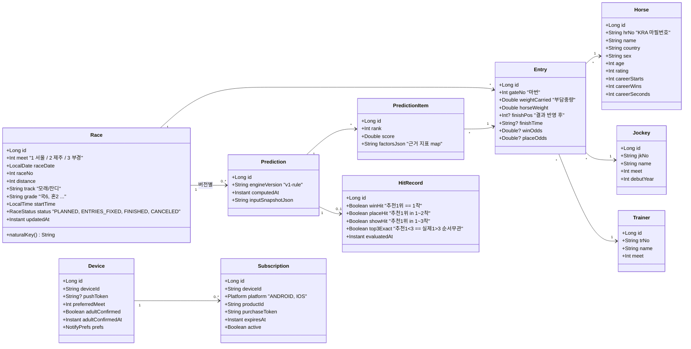
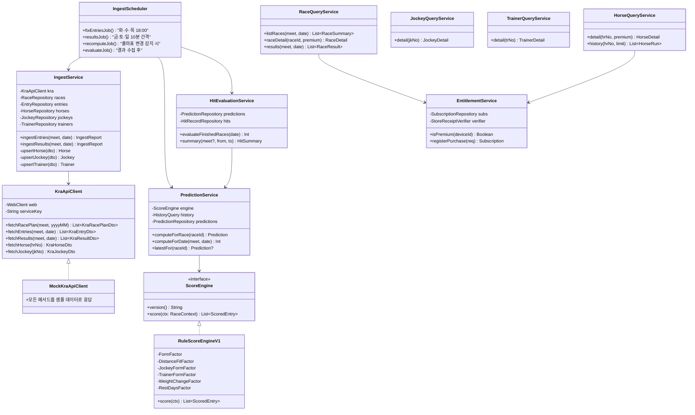
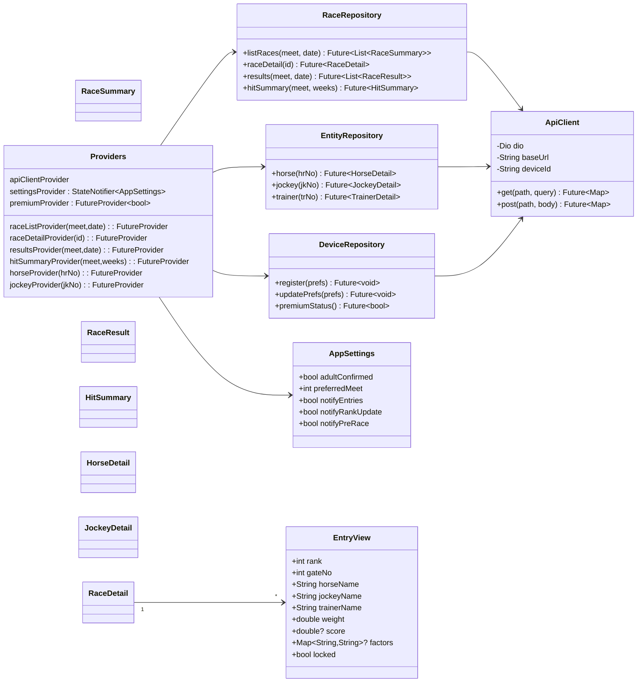

# 03. 클래스 다이어그램 — my_race

Mermaid 문법. GitHub / VS Code(Markdown Preview Mermaid) / mermaid.live 에서 렌더링.

## 1. 도메인 모델 (백엔드 JPA 엔티티)

## 2. 백엔드 서비스 계층

## 3. 프론트엔드 상태/모델 (Flutter · Riverpod)

## 4. 화면-라우트 매핑
| 라우트 | 화면 | Provider |
|---|---|---|
| `/onboarding` | S01, S02 | settingsProvider |
| `/` | S03 경주 목록 | raceListProvider |
| `/race/:id` | S04 | raceDetailProvider |
| `/horse/:hrNo` | S05 | horseProvider |
| `/jockey/:jkNo` | S06 | jockeyProvider |
| `/trainer/:trNo` | S07 | trainerProvider |
| `/results` | S08 | resultsProvider |
| `/hits` | S09 | hitSummaryProvider |
| `/premium` | S10 (모달) | premiumProvider |
| `/settings` | S11 | settingsProvider |
| `/settings/legal` | S12 | — |
